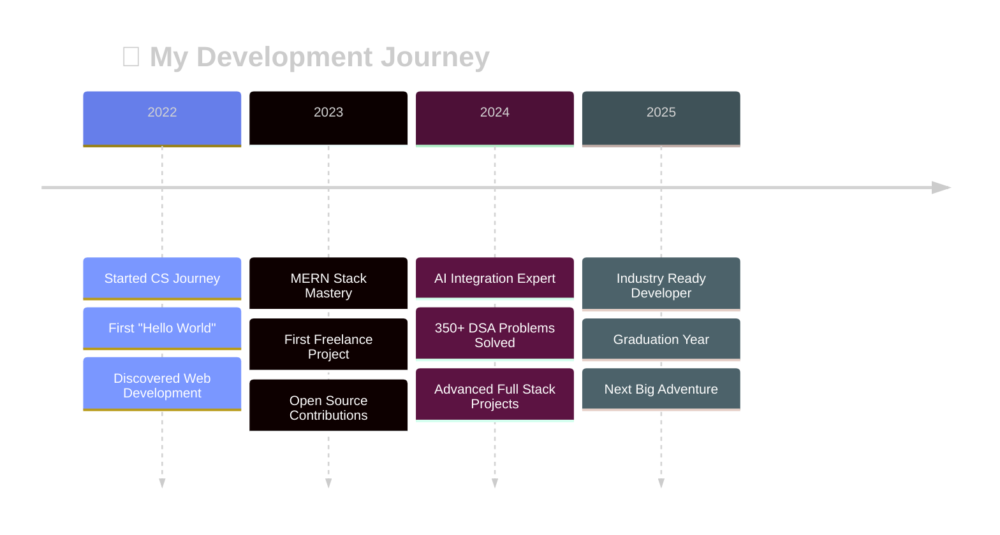

<div align="center">
  
</div>

<div align="center">
  
</div>

<br/>

<div align="center">
  
</div>

## 🎭 **Who Am I?**


<br clear="both"/>

```javascript
class AkshadApastambh extends FullStackDeveloper {
  constructor() {
    super();
    this.name = "Akshad Apastambh";
    this.title = "Full Stack Wizard 🧙‍♂️";
    this.location = "Nanded, Maharashtra, India 🇮🇳";
    this.education = {
      degree: "Bachelor's in Computer Science",
      institution: "SGGSITE Nanded",
      period: "2022-2026",
      cgpa: "Maintaining Excellence 📈"
    };
  }

  getCurrentStatus() {
    return {
      🔭 building: ["AI-Powered Applications", "Scalable Web Platforms"],
      🌱 learning: ["Advanced MERN Stack", "Machine Learning", "Cloud Architecture"],
      👯 collaborating: ["Open Source Projects", "Innovative Solutions"],
      💼 working: "Freelance Full Stack Developer",
      🧠 solved: "350+ DSA Problems",
      ⚡ superpower: "Turning Coffee into Code",
      🎯 goal: "Making the web more beautiful, one commit at a time"
    };
  }

  getSkillLevel() {
    return {
      frontend: "⭐⭐⭐⭐⭐",
      backend: "⭐⭐⭐⭐⭐", 
      problemSolving: "⭐⭐⭐⭐⭐",
      debugging: "⭐⭐⭐⭐⭐",
      coffeeConsumption: "⭐⭐⭐⭐⭐⭐⭐⭐⭐⭐"
    };
  }
}
```

<div align="center">
  
</div>

## 🛠️ **My Complete Tech Universe**

<div align="center">

### 🎨 **Frontend Technologies**
<div>
  
  
  
</div>

### ⚡ **Backend & Server Technologies**  
<div>
  
  
  
</div>

### ☁️ **DevOps & Cloud Services**
<div>
  
  
  
</div>

### 🛠️ **Development Tools & Utilities**
<div>
  
  
  
</div>

### 🤖 **AI/ML & Data Science**
<div>
  
  
</div>

### 📱 **Mobile & Cross-Platform**
<div>
  
</div>

### 🎮 **Game Development & 3D**
<div>
  
</div>

### 🔧 **Additional Tools & Technologies**
<div>
  
  
</div>

</div>

## 🏆 **Featured Projects**

<div align="center">
  <table>
    <tr>
      <td width="50%">
        <h3 align="center">🚀 Full Stack Projects</h3>
        <div align="center">
          
          
          <br><br>
          <p><strong>🎯 E-Commerce Platform</strong><br/>
          Full-featured online store with payment integration</p>
          <p><strong>💼 Portfolio Website</strong><br/>
          Modern responsive portfolio with animations</p>
          <p><strong>🤖 AI Chat Application</strong><br/>
          Real-time messaging with AI integration</p>
        </div>
      </td>
      <td width="50%">
        <h3 align="center">⚡ Recent Work</h3>
        <div align="center">
          
          
          <br><br>
          <p><strong>🌐 SaaS Dashboard</strong><br/>
          Multi-tenant dashboard with analytics</p>
          <p><strong>📱 Mobile App Backend</strong><br/>
          RESTful APIs with real-time features</p>
          <p><strong>🔗 Microservices Architecture</strong><br/>
          Scalable backend with Docker containers</p>
        </div>
      </td>
    </tr>
  </table>
</div>

## 📊 **Performance Dashboard**

<div align="center">
  
</div>

## 🎯 **Achievement Showcase**

<div align="center">
  <table>
    <tr>
      <td align="center" width="33%">
        
        <h4>🧠 Problem Solver</h4>
        <p>Mastered algorithms across multiple platforms</p>
      </td>
      <td align="center" width="33%">
        
        <h4>🚀 Project Builder</h4>
        <p>Full-stack applications with modern tech</p>
      </td>
      <td align="center" width="33%">
        
        <h4>💼 Professional Work</h4>
        <p>Real-world development experience</p>
      </td>
    </tr>
  </table>
</div>

## 🌟 **Interactive Elements**

<div align="center">
  
### 💭 **Daily Inspiration**
[](https://github.com/piyushsuthar/github-readme-quotes)

### 🎲 **Daily Motivation**


### 📚 **Learning & Growth**
<div align="center">
  
  
  
</div>

### 🎯 **Current Goals**
- 🚀 Build 15 more full-stack projects in 2025
- 🌟 Contribute to 5+ major open-source projects
- 📱 Master React Native & Flutter for mobile development  
- ☁️ Get AWS Solutions Architect certification
- 🤖 Master AI/ML technologies and build ML models
- 🎮 Explore game development with Unity
- 🌐 Learn Web3 and blockchain development

</div>

## 🌐 **Connect & Collaborate**

<div align="center">

[](https://akshadapastambh.dev)
[](https://linkedin.com/in/akshad-apastambh-9726332a1)
[](https://discord.gg/a_ap_57470)
[](https://instagram.com/ak_akshad)
[](https://x.com/Akshad168322)
[](mailto:akshadapastambh37@gmail.com)

</div>

<div align="center">

### 🚀 **Let's Build Something Amazing Together!**

[](mailto:akshadapastambh37@gmail.com)
[](https://github.com/AkshadAp17)
[](mailto:akshadapastambh37@gmail.com)

</div>

## 🎨 **Visual Timeline**

<div align="center">
  


</div>

## 📈 **GitHub Analytics**

<div align="center">

### 📊 **Detailed Stats**
<div align="center">
  
</div>

<div align="center">
  
  
</div>

</div>

---

<div align="center">

### 💫 **"Code is like humor. When you have to explain it, it's bad."** – Cory House


### ⭐ **If you like my work, consider giving my repos a star!** ⭐

</div>

<div align="center">
  
</div>
