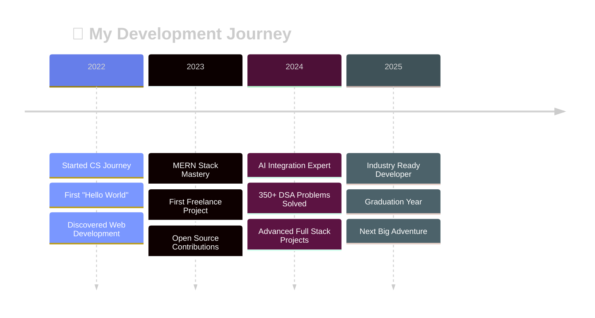

<div align="center">
  
</div>

<div align="center">
  
</div>

<br/>

<div align="center">
  
</div>

## 🎭 **Who Am I?**


<br clear="both"/>

```javascript
class AkshadApastambh extends FullStackDeveloper {
  constructor() {
    super();
    this.name = "Akshad Apastambh";
    this.title = "Full Stack Wizard 🧙‍♂️";
    this.location = "Nanded, Maharashtra, India 🇮🇳";
    this.education = {
      degree: "Bachelor's in Computer Science",
      institution: "SGGSITE Nanded",
      period: "2022-2026",
      cgpa: "Maintaining Excellence 📈"
    };
  }

  getCurrentStatus() {
    return {
      🔭 building: ["AI-Powered Applications", "Scalable Web Platforms"],
      🌱 learning: ["Advanced MERN Stack", "Machine Learning", "Cloud Architecture"],
      👯 collaborating: ["Open Source Projects", "Innovative Solutions"],
      💼 working: "Freelance Full Stack Developer",
      🧠 solved: "350+ DSA Problems",
      ⚡ superpower: "Turning Coffee into Code",
      🎯 goal: "Making the web more beautiful, one commit at a time"
    };
  }

  getSkillLevel() {
    return {
      frontend: "⭐⭐⭐⭐⭐",
      backend: "⭐⭐⭐⭐⭐", 
      problemSolving: "⭐⭐⭐⭐⭐",
      debugging: "⭐⭐⭐⭐⭐",
      coffeeConsumption: "⭐⭐⭐⭐⭐⭐⭐⭐⭐⭐"
    };
  }
}
```

<div align="center">
  
</div>

## 🛠️ **My Tech Universe**

<div align="center">

### 🎨 **Frontend Mastery**
<div>
  
</div>

### ⚡ **Backend Excellence**  
<div>
  
</div>

### ☁️ **Cloud & DevOps**
<div>
  
</div>

### 🤖 **AI & Tools**
<div>
  
</div>

</div>

<div align="center">
  
</div>

## 📊 **Performance Dashboard**

<div align="center">
  
</div>

## 🎯 **Achievement Showcase**

<div align="center">
  <table>
    <tr>
      <td align="center" width="50%">
        
        <h4>🏆 Top Contributions</h4>
      </td>
      <td align="center" width="50%">
        
        <h4>⏰ Coding Time</h4>
      </td>
    </tr>
  </table>
</div>

## 🌟 **Interactive Elements**

<div align="center">
  
### 💭 **Daily Inspiration**
[](https://github.com/piyushsuthar/github-readme-quotes)

### 🎵 **Currently Vibing To**
[](https://spotify.com)

### 🎲 **Random Dev Meme**


</div>

## 🌐 **Connect & Collaborate**

<div align="center">

[](https://akshadapastambh.dev)
[](https://linkedin.com/in/akshad-apastambh-9726332a1)
[](https://discord.gg/a_ap_57470)
[](https://instagram.com/ak_akshad)
[](https://x.com/Akshad168322)
[](mailto:akshadapastambh37@gmail.com)

</div>

<div align="center">

### 🚀 **Let's Build Something Amazing Together!**

[](mailto:akshadapastambh37@gmail.com)
[](https://github.com/AkshadAp17)
[](mailto:akshadapastambh37@gmail.com)

</div>

## 🎨 **Visual Timeline**

<div align="center">
  


</div>

## 🎮 **Fun Corner**

<div align="center">

### 🐍 **GitHub Snake Game**


### 📈 **Metrics Dashboard**


</div>

---

<div align="center">

### 💫 **"Code is like humor. When you have to explain it, it's bad."** – Cory House


### ⭐ **If you like my work, consider giving my repos a star!** ⭐

</div>

<div align="center">
  
</div>
